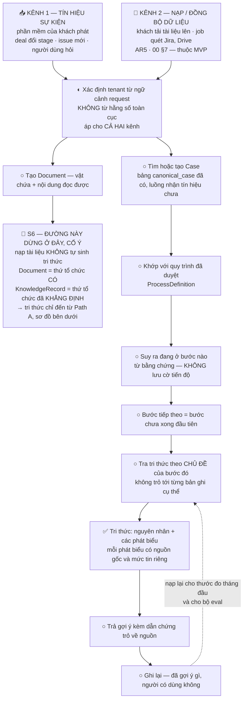
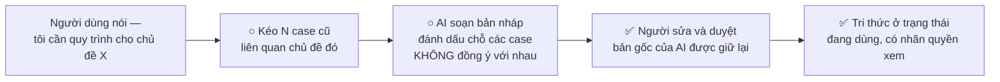
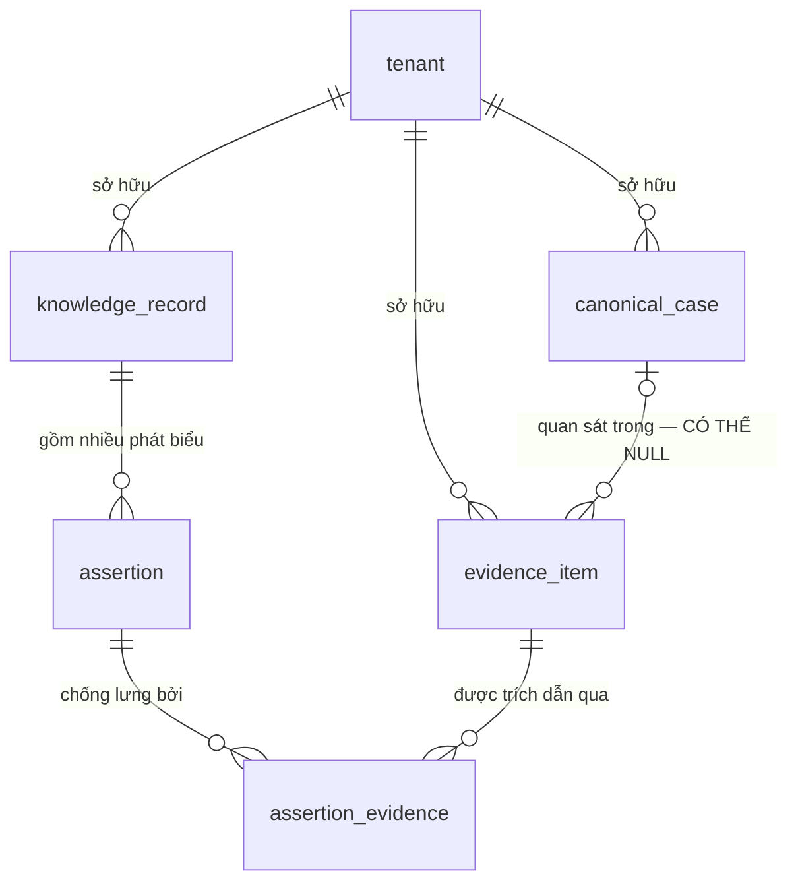
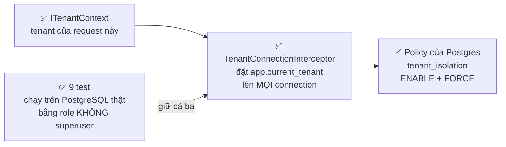

# AI Operational Knowledge & Process Platform

Nền tảng giúp doanh nghiệp đưa **đúng tri thức** và **đúng bước xử lý** đến đúng người,
đúng thời điểm — và khi tri thức chưa tồn tại thì giúp **tạo ra nó** từ dữ liệu vận hành
mà công ty đã có sẵn.

Đây không phải một ứng dụng người dùng đăng nhập vào. Nó là một service **phản ứng theo
sự kiện**: phần mềm có sẵn của khách (Jira, CRM, helpdesk...) phát tín hiệu, sản phẩm này
thức tỉnh, xử lý, và trả kết quả về.

Bên cạnh kênh tín hiệu đó còn một kênh thứ hai — **nạp / đồng bộ dữ liệu** (khách tải tài
liệu lên, job quét nguồn). Kênh này mang *vật chứa* vào, không mang *tri thức* vào: xem `S6`
trong sơ đồ dưới.

---

## ⚠ Đọc mục này trước khi đọc bất cứ thứ gì khác

```
Tài liệu thiết kế   ~10.300 dòng     27 quyết định domain + 11 quyết định khi code
Code                  ~1.300 dòng     slice nền móng đầu tiên
Test                    ~380 dòng     9 test, chạy trên PostgreSQL THẬT
```

**Tài liệu mô tả toàn bộ tầm nhìn. Code hiện có là phần nền móng của slice đầu tiên.**

Đừng đọc tài liệu rồi tưởng chức năng đã tồn tại. Xem [Đã build và chưa build](#đã-build-và-chưa-build)
để biết ranh giới thật.

**Giai đoạn hiện tại:** Workstream 07 — MVP Implementation, slice **Path A**
(gom nhiều case cũ thành một bản nháp quy trình, người sửa và duyệt).

**Mốc mới nhất — 2026-08-24:** ranh giới giữa các công ty khách hàng đã đóng hết một
vòng trên database thật, và có test giữ. Trước ngày này nó là thiết kế; giờ nó là thứ
đã đo được. Chi tiết: [Ranh giới tenant](#ranh-giới-tenant--đã-đo-trên-database-thật).

---

## Chạy thử

```bash
dotnet build src/KnowledgePlatform.slnx    # 0 lỗi 0 cảnh báo
```

**Chưa có gì khởi động được** — đây là hai thư viện + một bộ test, chưa có app.

### Chạy test (cần PostgreSQL)

```bash
# Một lần: dựng role + hai database. Cần superuser.
psql -U postgres -h localhost -f scripts/dev-db-setup.sql

dotnet test src/KnowledgePlatform.slnx     # 9 test, tự apply migration
```

Test chạy trên **PostgreSQL thật**, cố ý. Row-level security là tính năng của database;
test nó bằng in-memory provider là test một thứ khác rồi tự cho mình cảm giác an toàn.

```
⚠ ĐỪNG chạy app hay test bằng role `postgres` hay bất kỳ superuser nào.
  Superuser ĐI VÒNG QUA row-level security, kể cả khi bảng có FORCE.
  → RLS bằng KHÔNG, và mọi test cách ly tenant PASS GIẢ.
  Test đầu tiên trong bộ test kiểm đúng điều này và sẽ đỏ nếu bạn làm vậy.
```

Đổi database khác: đặt biến môi trường `KP_TEST_DB`.

```bash
# Sinh migration (không cần DB thật)
dotnet ef migrations add TênMigration --project src/KnowledgePlatform.Infrastructure

# Apply lên DB thật
dotnet ef database update --project src/KnowledgePlatform.Infrastructure   --connection "Host=localhost;Database=kp_dev;Username=kp_app;Password=..."
```

Công nghệ: **C# / .NET 10 + PostgreSQL**. Quyết định và lý do ở
[`docs/06_MVP_ARCHITECTURE.md`](docs/06_MVP_ARCHITECTURE.md).

---

## Luồng chạy khi có một tín hiệu

Sơ đồ này là **thiết kế**, không phải mô tả code hiện có.
`✅` = đã build · `◐` = mới có một phần · `○` = chưa build.

> ⚠ **Mũi tên là thứ tự dữ liệu chảy LÚC CHẠY, không phải thứ tự BUILD.**
> Hai thứ này khác nhau. Slice đầu tiên không đi theo sơ đồ này mà đi theo
> [sơ đồ Path A bên dưới](#luồng-ngược--slice-đang-build) — lý do ở ngay dưới đó.

Thông tin ở đây rải trong ba tài liệu khác nhau (`06` §1, `05` §5, `04` §3B.1) nên nó
được vẽ lại ở đây cho gọn.



**Về ô tenant (`◐`)** — đường ống đã nối xong, chỉ còn thiếu đầu vào:

```
✅ ITenantContext là interface phải tiêm vào, không phải static
✅ RLS ở tầng DB + RlsGuard kiểm lúc khởi động — ĐÃ CHẠY THẬT, PASS
✅ app.current_tenant được đặt tự động trên MỌI connection mở ra
   → C# và Postgres giờ biết cùng một TenantId. Có 9 test giữ.
❌ chưa có cài đặt nào đọc tenant từ request thật
   → vì chưa có project host, nên chưa có "request" nào tồn tại.
     Đây là mảnh cuối, và nó chặn mọi việc còn lại của slice.
```

**Về `S6`** — đây là chỗ dễ hiểu nhầm nhất của sơ đồ. Tải tài liệu lên **không** làm hệ
thống có tri thức; nó chỉ làm hệ thống có *vật chứa*. Chi tiết: `04` §1.9.

---

## Luồng ngược — slice đang build

Khi khách **chưa có** quy trình nào trong hệ thống, luồng trên không có gì để chạy — và đó
là tình trạng ngày đầu ở khách hàng #0 (chỉ 10% quy trình là viết ra và tìm được; §8.1 đã đi
kiểm chứng thực tế và xác nhận **không có SOP viết**). Nên slice đầu tiên làm **đường ngược lại**:



Chênh lệch giữa **bản AI soạn** và **bản người duyệt** vừa là thước đo chính của tháng đầu,
vừa là nhãn cho bộ eval. Đó là lý do bản gốc không bao giờ bị ghi đè.

### Vì sao build đường này trước, không build kênh nhận tín hiệu trước

```
1  Không có gì để tải lên      §8.1 đã xác nhận khách #0 không có SOP viết
2  Kể cả có thì S6 chặn        nạp tài liệu ra Document, KHÔNG ra KnowledgeRecord
                               → build xong kênh nạp vẫn là 0 tri thức
3  Chỉ Path A đẻ được cái      nó có "hành vi khẳng định" (người duyệt) mà S6 đòi
   đầu tiên                    07 §1: "Cap 1 và Cap 2 không có gì để làm cho tới
                               khi Path A tạo ra thứ đầu tiên"
4  Ranh giới tenant đi trước   nhồi vào sau rất đắt: phải backfill TenantId, rà lại
   mọi thứ                     mọi truy vấn đã viết. D3 + G7. Nên RLS nằm trong
                               CHÍNH migration đầu tiên — không có khoảnh khắc nào
                               bảng tồn tại mà chưa được bảo vệ.
```

Nguyên tắc xếp thứ tự ở đây là **làm trước cái mà làm sau sẽ đắt**, không phải làm trước
cái đứng đầu mũi tên.

---

## Hình dạng dữ liệu

Sáu bảng. Sơ đồ chỉ vẽ **quan hệ**, không liệt kê field — field thì đọc code, đó là bản thật.



Hai chỗ không hiển nhiên:

- **`assertion_evidence` là một bảng riêng, không phải quan hệ nhiều-nhiều trơn** — vì liên
  kết có thuộc tính của riêng nó: dẫn chứng này *chống lưng*, *phản bác*, hay chỉ là *ngữ cảnh*,
  kèm ghi chú kiểu *"14/20 case làm bước này"*. Chính chỗ này là lý do chọn cơ sở dữ liệu quan hệ.
- **`evidence_item.ObservedInCaseId` được phép NULL, và điều đó quan trọng** — một email của
  senior hay một tin Zalo không thuộc case nào. Với thực tế 60% tri thức nằm rải rác thì đó
  không phải trường hợp hiếm.

**Một tri thức không phải một khối văn bản.** Nó là một nguyên nhân, gồm nhiều phát biểu, mỗi
phát biểu tự mang nguồn gốc và mức tin riêng:

```
knowledge_record   "Parser dưới 2.3 bỏ qua payload OTA dạng X"
├── assertion  [nguyên nhân tồn tại]   nguồn: AI suy luận   tin: đã xác minh
├── assertion  [cách nhận ra]          nguồn: AI suy luận   tin: ⚠ MÂU THUẪN
├── assertion  [áp dụng cho]           nguồn: AI suy luận   tin: có chứng cứ
└── assertion  [cách xử lý]            nguồn: AI suy luận   tin: có chứng cứ
```

`MÂU THUẪN` là một giá trị hạng nhất, **không phải lỗi** và không phải "hơi tin". Khi gom 20
case, chỗ các case không đồng ý chính là chỗ người duyệt cần nhìn — nó cho phép duyệt trong
10 phút thay vì 2 giờ.

---

## Năm cơ chế cốt lõi — đây là toàn bộ giá trị của slice hiện tại

Cả năm nhắm vào cùng một loại lỗi: **lỗi thất bại im lặng**. Không crash, không báo, chỉ nằm
trong dữ liệu tới khi quá muộn.

| Rủi ro | Cơ chế chặn | Ở đâu |
|---|---|---|
| Tạo phát biểu mà không khai nguồn gốc | Trường bắt buộc, không có mặc định → **không biên dịch được** | [`Assertion.cs`](src/KnowledgePlatform.Domain/Knowledge/Assertion.cs) |
| Thêm bảng mà quên bảo mật tenant | Danh sách bảng suy từ model, đối chiếu lúc khởi động → **không start được** | [`RlsGuard.cs`](src/KnowledgePlatform.Infrastructure/Persistence/RlsGuard.cs) |
| Lấy tenant từ biến toàn cục | Là interface phải tiêm vào, không phải static | [`ITenantContext.cs`](src/KnowledgePlatform.Domain/Tenancy/ITenantContext.cs) |
| Quên nói cho database biết đang phục vụ khách nào | Đặt tự động ở tầng connection, không có đường vòng | [`TenantConnectionInterceptor.cs`](src/KnowledgePlatform.Infrastructure/Persistence/TenantConnectionInterceptor.cs) |
| Lưu trạng thái đáng ra phải suy ra | Danh sách giá trị chỉ có 3 → vi phạm thành **hành động cố ý** | [`KnowledgeVocabulary.cs`](src/KnowledgePlatform.Domain/Knowledge/KnowledgeVocabulary.cs) |

Ranh giới giữa các công ty khách hàng có **hai lớp**, và thứ tự quan trọng:

```
Lớp 1  PostgreSQL row-level security   ← NGUỒN QUYỀN LỰC THẬT
       Database tự chặn, kể cả khi lập trình viên quên câu WHERE
Lớp 2  Bộ lọc của EF Core              ← chỉ là tiện lợi, KHÔNG phải ranh giới bảo mật
       Một câu SQL thô là đi vòng qua nó ngay
```

---

## Ranh giới tenant — đã đo trên database thật

Trước 2026-08-24, bằng chứng duy nhất là "SQL sinh ra trông đúng". Vấn đề: cái bẫy lớn
nhất của RLS làm nó **bật mà không chặn gì, và không báo** — đọc SQL không phát hiện được.

Giờ đường đi đã liền một mạch, và mỗi mắt được một test giữ:



**Đo được gì:**

| Thử | Kết quả |
|---|---|
| Câu SQL thô cố ý quên điều kiện tenant | Chỉ thấy dữ liệu của đúng khách hàng đó |
| Ghi dữ liệu mang mã khách hàng khác | Postgres từ chối |
| Chưa xác định được khách hàng nào | Thấy **0 dòng**, không phải thấy hết |
| Connection lấy lại từ pool | Không thừa hưởng khách hàng của lượt trước |
| Thêm bảng mà quên bật bảo mật | `RlsGuard` ném, và chỉ rõ **tên bảng** |

**Và quan trọng hơn: bộ test đã được chứng minh biết ĐỎ.** Test xanh mà không thể đỏ thì
không phải bằng chứng, nó chỉ là sự yên tâm.

```
Gỡ FORCE khỏi một bảng      → 5 test đỏ    (đúng cái bẫy im lặng của RLS)
Gỡ nullif khỏi policy       → 3 test đỏ    (đúng lỗi tìm được hôm nay)
Trỏ test vào role superuser → test đầu đỏ  (bộ đo tự tố giác khi nó vô nghĩa)
```

**Hai thứ chỉ chạy thật mới thấy** — cả hai đều là lỗi im lặng, cả hai đã sửa:

```
1  Policy văng lỗi ép kiểu, không phải trả 0 dòng
   Sau một RESET — chuyện connection pool làm — biến session thành CHUỖI RỖNG,
   và ''::uuid ném lỗi. Không rò rỉ, nhưng thông báo lỗi không nhắc gì tới tenant
   nên người đọc đi tìm sai hướng. → sửa bằng nullif(...) ở migration thứ hai.

2  Superuser đi vòng qua RLS, KỂ CẢ khi có FORCE
   Chạy app hay test bằng `postgres` là RLS bằng không — và mọi test cách ly
   tenant PASS GIẢ. Đây là loại lỗi làm hỏng chính BỘ ĐO, nguy hiểm hơn loại 1.
   → role riêng kp_app (không superuser), và một test kiểm đúng điều này.
```

Lý do và bằng chứng đầy đủ: [`docs/07_MVP_IMPLEMENTATION.md`](docs/07_MVP_IMPLEMENTATION.md)
§3 (`IM-9`, `IM-10`) và §7.

---

## Đã build và chưa build

**Đã có** — 6 bảng, build sạch 0 cảnh báo, và bảo mật tenant đã **chạy thật**:

```
tenant · canonical_case · evidence_item · knowledge_record · assertion · assertion_evidence
        └───────────── 5 bảng sau đều có bảo mật tenant ─────────────┘
                        ✅ đã đo trên PostgreSQL 18.6, 9 test giữ
```

**Chưa có:**

```
· Project host (API / Worker) để có "request"  → ĐANG CHẶN 4 dòng dưới nó
· Cài đặt ITenantContext đọc tenant từ request → mới có hợp đồng, chưa có thân
                                                 (vì chưa có request nào tồn tại)
· Truy vấn "tìm N case cũ liên quan"
· Phần gọi AI soạn nháp quy trình              → bề mặt AI của MVP chỉ có 2 hàm
· Luồng duyệt
· Kênh 1 — đường nhận tín hiệu từ khách
· Kênh 2 — đường nạp/đồng bộ tài liệu (AR5)
· Bảng Document lưu tài liệu khách nạp lên     → đích của kênh 2, chưa có entity
· Phép so bản nháp AI với bản người sửa
· ProcessDefinition / ProcessRun               → thiết kế xong, chưa code
· Test cho phần tri thức (Assertion, lifecycle) → hiện chỉ ranh giới tenant có test
```

`canonical_case` chỉ có 5 field và đó là **cố ý**: mô hình đầy đủ có thêm 9 thành phần
(lịch sử sự kiện, người phụ trách theo thời gian, phân loại...), nhưng slice này chỉ cần
*tìm* và *gom* case.

---

## Rủi ro đang mở

| | |
|---|---|
| ⚠ **Chưa có chỗ nào đọc tenant từ một request thật** | Đường ống từ C# xuống Postgres đã nối và đã đo. Nhưng đầu vào của nó — "khách hàng nào đang gọi" — chưa tồn tại, vì chưa có project host nên chưa có request nào. Đây là mảnh cuối của ranh giới tenant. |
| ⚠ **Hai cơ chế phía tri thức chưa bị thử phá** | 3 trong 5 cơ chế giờ có test (RLS guard, mắt xích tenant, và interface tenant). Hai cơ chế còn lại — bắt buộc khai nguồn gốc, và danh sách trạng thái chỉ có 3 giá trị — chỉ được **trình biên dịch** chặn. Chặn lúc biên dịch mạnh hơn test, nhưng nó không kiểm được cái mà nó không thấy: một nơi gọi truyền `Origin` **sai** vẫn biên dịch bình thường. Đó đúng là kiểu lỗi mà `AP3` gọi là im lặng nhất. |
| ⚠ Chưa chốt lấy chuỗi kết nối / mật khẩu DB từ đâu ở deploy thật | Hiện chỉ có mặc định cho máy dev, ghi đè được bằng biến môi trường `KP_TEST_DB`. Cần quyết cùng lúc với project host — `AR-d` trong `07` §5. |
| ⚠ Kết luận "không cần vector DB" đứng trên n=1 | Dựa vào con số "5-10 loại nguyên nhân" chưa ai đếm. Phép đếm mất ~30 phút, chưa chạy. |
| ⚠ Nhãn quyền xem để dạng chuỗi tự do | Chưa ai chốt danh sách giá trị cho phép. Cố ý không tự phát minh ở tầng code. |

---

## Đọc tài liệu theo thứ tự nào

```
1  docs/00_CURRENT_STATE.md            trạng thái + việc đang làm. ĐỌC TRƯỚC.
2  AGENT.md                            cách làm việc trong dự án, các guardrail
3  docs/PROJECT_CONTEXT.md             khảo sát + tầm nhìn sản phẩm
4  docs/Canonical Case Model v0.2.md   mô hình Case
5  docs/04_KNOWLEDGE_MODEL_V0.1.md     mô hình Tri thức — 23 quyết định
6  docs/05_PROCESS_MODEL_V0.1.md       mô hình Quy trình — 4 quyết định
7  docs/06_MVP_ARCHITECTURE.md         quyết định công nghệ
8  docs/07_MVP_IMPLEMENTATION.md       nhật ký quyết định phát sinh khi code
                                       §3 IM-9/IM-10 và §7 là phần mới nhất
```

**Đọc nhanh nhất:** `04` §3C.5 (hình dạng đầy đủ của một tri thức) và `06` §10
(6 ràng buộc dễ sai nhất).

⚠ **Bẫy cho người mới:** `AGENT.md` §1 yêu cầu đọc `docs/01_...`, `docs/02_PRODUCT_FOUNDATION_V1.md`,
`docs/03_...`. Tên file thật khác, và **`02_PRODUCT_FOUNDATION_V1.md` không tồn tại** — nó đã bị
mất cùng toàn bộ Success Metrics. Metrics đã được dựng lại ở `docs/02_SUCCESS_METRICS_V1.md`;
phần capability contract và non-goals thì vẫn mất.

---

## Quy tắc khi sửa file này

Dự án đã phải dọn 9 lần mâu thuẫn giữa các tài liệu nói về cùng một thứ, và bệnh "từ vựng
song song" tái phát 3 lần trong một workstream. Nên:

```
File này TRỎ ĐƯỜNG, không định nghĩa lại.
Từ vựng đã khóa nằm ở docs/04_KNOWLEDGE_MODEL_V0.1.md §3D.7 — tham chiếu DUY NHẤT.
Field cụ thể thì đọc code, đó là bản thật. Đừng chép field vào đây.
Sơ đồ vẽ bằng mermaid, không phải file ảnh — để thấy được trong diff khi nó sai.
```
