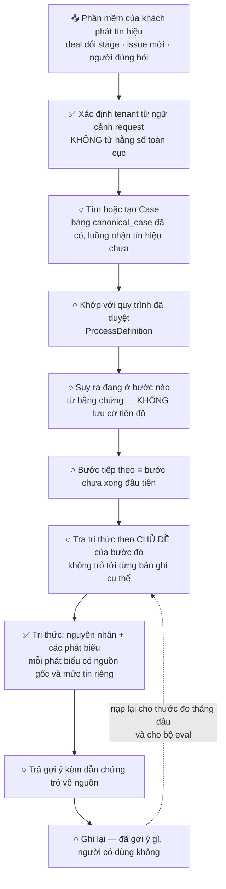
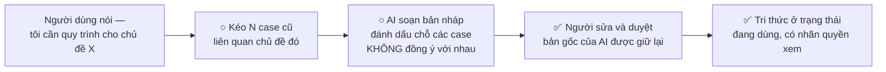
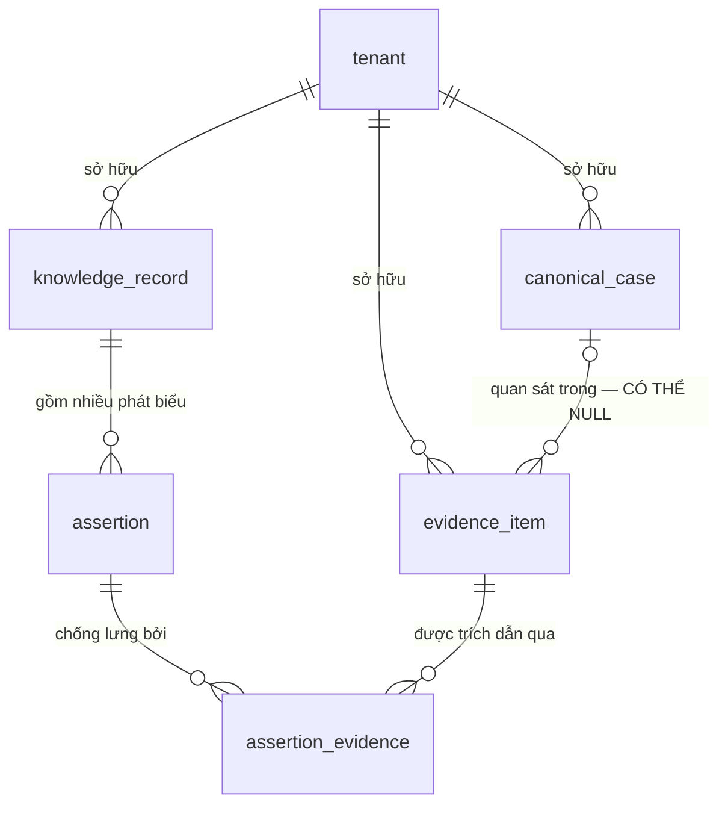

# AI Operational Knowledge & Process Platform

Nền tảng giúp doanh nghiệp đưa **đúng tri thức** và **đúng bước xử lý** đến đúng người,
đúng thời điểm — và khi tri thức chưa tồn tại thì giúp **tạo ra nó** từ dữ liệu vận hành
mà công ty đã có sẵn.

Đây không phải một ứng dụng người dùng đăng nhập vào. Nó là một service **phản ứng theo
sự kiện**: phần mềm có sẵn của khách (Jira, CRM, helpdesk...) phát tín hiệu, sản phẩm này
thức tỉnh, xử lý, và trả kết quả về.

---

## ⚠ Đọc mục này trước khi đọc bất cứ thứ gì khác

```
Tài liệu thiết kế    ~9.800 dòng     27 quyết định domain đã chốt
Code                   ~960 dòng     slice nền móng đầu tiên
```

**Tài liệu mô tả toàn bộ tầm nhìn. Code hiện có là phần nền móng của slice đầu tiên.**

Đừng đọc tài liệu rồi tưởng chức năng đã tồn tại. Xem [Đã build và chưa build](#đã-build-và-chưa-build)
để biết ranh giới thật.

**Giai đoạn hiện tại:** Workstream 07 — MVP Implementation, slice **Path A**
(gom nhiều case cũ thành một bản nháp quy trình, người sửa và duyệt).

---

## Chạy thử

```bash
dotnet build src/KnowledgePlatform.slnx
```

Build sạch, 0 lỗi 0 cảnh báo. **Nhưng chưa có gì khởi động được** — đây là hai thư viện,
chưa có app. Cũng chưa có PostgreSQL để apply migration.

```bash
# Sinh migration (không cần DB thật)
dotnet ef migrations add TênMigration --project src/KnowledgePlatform.Infrastructure

# Xem SQL sẽ chạy
dotnet ef migrations script --project src/KnowledgePlatform.Infrastructure
```

Công nghệ: **C# / .NET 10 + PostgreSQL**. Quyết định và lý do ở
[`docs/06_MVP_ARCHITECTURE.md`](docs/06_MVP_ARCHITECTURE.md).

---

## Luồng chạy khi có một tín hiệu

Sơ đồ này là **thiết kế**, không phải mô tả code hiện có. ✅ = đã build · ○ = chưa build.
Thông tin ở đây rải trong ba tài liệu khác nhau (`06` §1, `05` §5, `04` §3B.1) nên nó
được vẽ lại ở đây cho gọn.



Khi khách **chưa có** quy trình nào trong hệ thống, luồng trên không có gì để chạy — và đó
là tình trạng ngày đầu ở khách hàng #0 (chỉ 10% quy trình là viết ra và tìm được). Nên slice
đầu tiên làm **đường ngược lại**:



Chênh lệch giữa **bản AI soạn** và **bản người duyệt** vừa là thước đo chính của tháng đầu,
vừa là nhãn cho bộ eval. Đó là lý do bản gốc không bao giờ bị ghi đè.

---

## Hình dạng dữ liệu

Sáu bảng. Sơ đồ chỉ vẽ **quan hệ**, không liệt kê field — field thì đọc code, đó là bản thật.



Hai chỗ không hiển nhiên:

- **`assertion_evidence` là một bảng riêng, không phải quan hệ nhiều-nhiều trơn** — vì liên
  kết có thuộc tính của riêng nó: dẫn chứng này *chống lưng*, *phản bác*, hay chỉ là *ngữ cảnh*,
  kèm ghi chú kiểu *"14/20 case làm bước này"*. Chính chỗ này là lý do chọn cơ sở dữ liệu quan hệ.
- **`evidence_item.ObservedInCaseId` được phép NULL, và điều đó quan trọng** — một email của
  senior hay một tin Zalo không thuộc case nào. Với thực tế 60% tri thức nằm rải rác thì đó
  không phải trường hợp hiếm.

**Một tri thức không phải một khối văn bản.** Nó là một nguyên nhân, gồm nhiều phát biểu, mỗi
phát biểu tự mang nguồn gốc và mức tin riêng:

```
knowledge_record   "Parser dưới 2.3 bỏ qua payload OTA dạng X"
├── assertion  [nguyên nhân tồn tại]   nguồn: AI suy luận   tin: đã xác minh
├── assertion  [cách nhận ra]          nguồn: AI suy luận   tin: ⚠ MÂU THUẪN
├── assertion  [áp dụng cho]           nguồn: AI suy luận   tin: có chứng cứ
└── assertion  [cách xử lý]            nguồn: AI suy luận   tin: có chứng cứ
```

`MÂU THUẪN` là một giá trị hạng nhất, **không phải lỗi** và không phải "hơi tin". Khi gom 20
case, chỗ các case không đồng ý chính là chỗ người duyệt cần nhìn — nó cho phép duyệt trong
10 phút thay vì 2 giờ.

---

## Bốn cơ chế cốt lõi — đây là toàn bộ giá trị của slice hiện tại

Cả bốn nhắm vào cùng một loại lỗi: **lỗi thất bại im lặng**. Không crash, không báo, chỉ nằm
trong dữ liệu tới khi quá muộn.

| Rủi ro | Cơ chế chặn | Ở đâu |
|---|---|---|
| Tạo phát biểu mà không khai nguồn gốc | Trường bắt buộc, không có mặc định → **không biên dịch được** | [`Assertion.cs`](src/KnowledgePlatform.Domain/Knowledge/Assertion.cs) |
| Thêm bảng mà quên bảo mật tenant | Danh sách bảng suy từ model, đối chiếu lúc khởi động → **không start được** | [`RlsGuard.cs`](src/KnowledgePlatform.Infrastructure/Persistence/RlsGuard.cs) |
| Lấy tenant từ biến toàn cục | Là interface phải tiêm vào, không phải static | [`ITenantContext.cs`](src/KnowledgePlatform.Domain/Tenancy/ITenantContext.cs) |
| Lưu trạng thái đáng ra phải suy ra | Danh sách giá trị chỉ có 3 → vi phạm thành **hành động cố ý** | [`KnowledgeVocabulary.cs`](src/KnowledgePlatform.Domain/Knowledge/KnowledgeVocabulary.cs) |

Ranh giới giữa các công ty khách hàng có **hai lớp**, và thứ tự quan trọng:

```
Lớp 1  PostgreSQL row-level security   ← NGUỒN QUYỀN LỰC THẬT
       Database tự chặn, kể cả khi lập trình viên quên câu WHERE
Lớp 2  Bộ lọc của EF Core              ← chỉ là tiện lợi, KHÔNG phải ranh giới bảo mật
       Một câu SQL thô là đi vòng qua nó ngay
```

Hai chi tiết dễ sai đã được xử lý trong [migration đầu tiên](src/KnowledgePlatform.Infrastructure/Migrations/20260823081823_InitialPathASchema.cs):
`FORCE ROW LEVEL SECURITY` (thiếu nó thì chủ sở hữu bảng **được miễn** luật), và luật viết sao cho
quên đặt tenant thì **không thấy gì** chứ không phải thấy hết.

---

## Đã build và chưa build

**Đã có** — 6 bảng, build sạch 0 cảnh báo:

```
tenant · canonical_case · evidence_item · knowledge_record · assertion · assertion_evidence
        └───────────── 5 bảng sau đều có bảo mật tenant ─────────────┘
```

**Chưa có:**

```
· Truy vấn "tìm N case cũ liên quan"
· Phần gọi AI soạn nháp quy trình              → bề mặt AI của MVP chỉ có 2 hàm
· Luồng duyệt
· Đường nhận tín hiệu từ hệ thống của khách
· Phép so bản nháp AI với bản người sửa
· ProcessDefinition / ProcessRun               → thiết kế xong, chưa code
· Bảng lưu tài liệu khách nạp lên
· Test — chưa có test nào
```

`canonical_case` chỉ có 5 field và đó là **cố ý**: mô hình đầy đủ có thêm 9 thành phần
(lịch sử sự kiện, người phụ trách theo thời gian, phân loại...), nhưng slice này chỉ cần
*tìm* và *gom* case.

---

## Rủi ro đang mở

| | |
|---|---|
| ⚠ **Bảo mật tenant chưa chạy trên database thật** | Máy phát triển không có PostgreSQL. SQL đúng cú pháp ≠ chặn được thật. **Đây là việc đầu tiên khi có Postgres.** |
| ⚠ Chưa có test nào | Bốn cơ chế ở trên là giá trị chính của slice, và chưa cơ chế nào được test. |
| ⚠ Kết luận "không cần vector DB" đứng trên n=1 | Dựa vào con số "5-10 loại nguyên nhân" chưa ai đếm. Phép đếm mất ~30 phút, chưa chạy. |
| ⚠ Nhãn quyền xem để dạng chuỗi tự do | Chưa ai chốt danh sách giá trị cho phép. Cố ý không tự phát minh ở tầng code. |

---

## Đọc tài liệu theo thứ tự nào

```
1  docs/00_CURRENT_STATE.md            trạng thái + việc đang làm. ĐỌC TRƯỚC.
2  AGENT.md                            cách làm việc trong dự án, các guardrail
3  docs/PROJECT_CONTEXT.md             khảo sát + tầm nhìn sản phẩm
4  docs/Canonical Case Model v0.2.md   mô hình Case
5  docs/04_KNOWLEDGE_MODEL_V0.1.md     mô hình Tri thức — 23 quyết định
6  docs/05_PROCESS_MODEL_V0.1.md       mô hình Quy trình — 4 quyết định
7  docs/06_MVP_ARCHITECTURE.md         quyết định công nghệ
8  docs/07_MVP_IMPLEMENTATION.md       nhật ký quyết định phát sinh khi code
```

**Đọc nhanh nhất:** `04` §3C.5 (hình dạng đầy đủ của một tri thức) và `06` §10
(6 ràng buộc dễ sai nhất).

⚠ **Bẫy cho người mới:** `AGENT.md` §1 yêu cầu đọc `docs/01_...`, `docs/02_PRODUCT_FOUNDATION_V1.md`,
`docs/03_...`. Tên file thật khác, và **`02_PRODUCT_FOUNDATION_V1.md` không tồn tại** — nó đã bị
mất cùng toàn bộ Success Metrics. Metrics đã được dựng lại ở `docs/02_SUCCESS_METRICS_V1.md`;
phần capability contract và non-goals thì vẫn mất.

---

## Quy tắc khi sửa file này

Dự án đã phải dọn 9 lần mâu thuẫn giữa các tài liệu nói về cùng một thứ, và bệnh "từ vựng
song song" tái phát 3 lần trong một workstream. Nên:

```
File này TRỎ ĐƯỜNG, không định nghĩa lại.
Từ vựng đã khóa nằm ở docs/04_KNOWLEDGE_MODEL_V0.1.md §3D.7 — tham chiếu DUY NHẤT.
Field cụ thể thì đọc code, đó là bản thật. Đừng chép field vào đây.
Sơ đồ vẽ bằng mermaid, không phải file ảnh — để thấy được trong diff khi nó sai.
```
