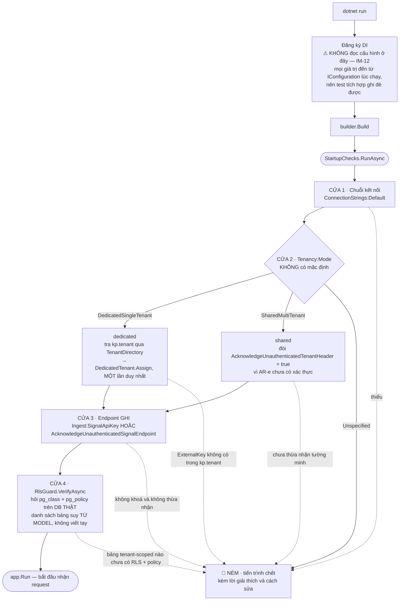
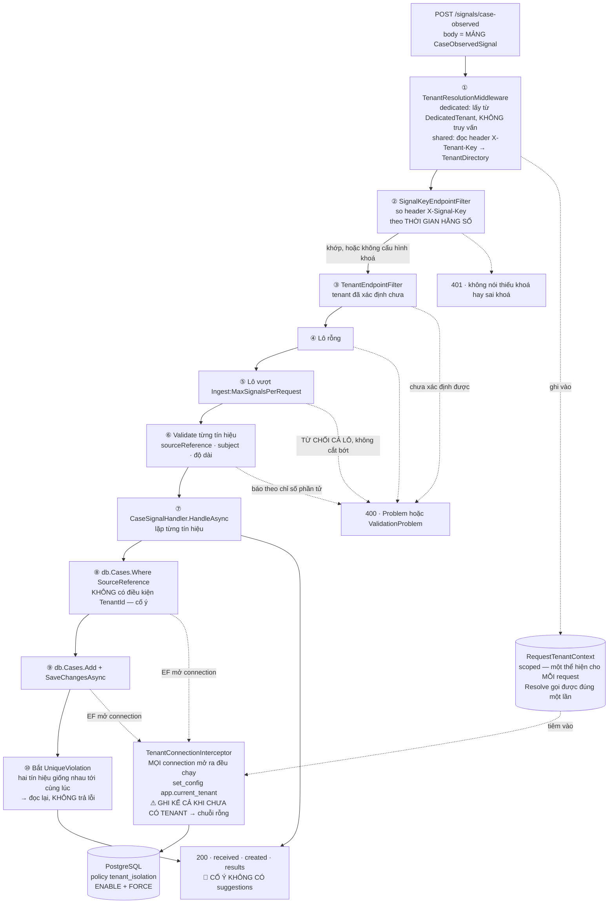

# 08 — Code Map

## Sơ đồ luồng CODE · bản đồ cho người mới mở repo

> **File này khác `README.md` §"Luồng chạy khi có một tín hiệu" ở đúng một điểm, và
> đó là điểm quan trọng nhất:**
>
> | | Vẽ cái gì | Sai khi nào |
> |---|---|---|
> | `README` §Luồng chạy | **Thiết kế** — nghiệp vụ muốn gì | Khi thiết kế đổi |
> | **File này** | **Code hiện có** — request đi qua file nào, theo thứ tự nào | Khi code đổi |
>
> Sơ đồ ở `README` có ô `○` cho thứ chưa build. **File này không có ô `○`.** Cái gì
> chưa build thì không nằm ở đây — vì đây là bản đồ để *đọc code*, và không đọc được
> thứ chưa tồn tại. Muốn biết còn thiếu gì thì xem `README` §"Đã build và chưa build".

Lý do file này tồn tại: ba thứ dưới đây **không nằm trong file nào cả** — chúng nằm
*giữa* các file, nên "field thì đọc code" không cứu được.

1. Thứ tự pipeline lúc chạy, và mọi chỗ request có thể dừng sớm
2. Bốn cửa chặn lúc khởi động
3. Endpoint nào đòi khoá, endpoint nào đòi tenant, endpoint nào không đòi gì

---

# 1. Chuỗi khởi động — bốn cửa, hỏng cửa nào cũng là KHÔNG START ĐƯỢC

Nguyên tắc của cả bốn: **quên là không start được, không phải rò rỉ lúc chạy.**
Health check báo *sau* khi đã start — tức là có một khoảng thời gian ứng dụng chạy ở
trạng thái sai. Với ranh giới tenant (`G7` gọi là nền tảng) thì khoảng đó không được
tồn tại.



| Ô | File |
|---|---|
| Đăng ký DI, `builder.Build` | [Program.cs](../src/KnowledgePlatform.Api/Program.cs) |
| Cả bốn cửa | [StartupChecks.cs](../src/KnowledgePlatform.Api/Startup/StartupChecks.cs) |
| Tra `kp.tenant` | [TenantDirectory.cs](../src/KnowledgePlatform.Api/Tenancy/TenantDirectory.cs) |
| Giữ tenant của bản dedicated | [RequestTenantContext.cs](../src/KnowledgePlatform.Api/Tenancy/RequestTenantContext.cs) — class `DedicatedTenant` |
| Cửa 4 | [RlsGuard.cs](../src/KnowledgePlatform.Infrastructure/Persistence/RlsGuard.cs) |
| Danh sách bảng cần RLS | [AppDbContext.cs](../src/KnowledgePlatform.Infrastructure/Persistence/AppDbContext.cs) — `TenantScopedTables` |

**Cửa 4 là chỗ khó thấy nhất.** `TenantScopedTables` suy ra từ model bằng phản chiếu:
entity nào cài `ITenantScoped` là tự động vào danh sách. Nên thêm entity mới mà
migration quên bật RLS thì **không start được**, và thông báo chỉ đúng **tên bảng**.
Không có đường nào thêm bảng mà quên bảo mật.

**`DedicatedTenant` là chỗ duy nhất trong hệ thống có giá trị tenant sống lâu hơn một
request** — nên nó đóng lại được: `Assign` lần thứ hai là ném.

---

# 2. Một request tín hiệu đi qua đâu

Đây là đường **đã build đầy đủ** duy nhất chạm tới dữ liệu và ghi vào DB. Đọc hiểu
đường này là hiểu được kiến trúc, vì mọi endpoint sau sẽ đi lại đúng các mắt xích này.



| Ô | File |
|---|---|
| Định tuyến, ④⑤⑥, thứ tự filter | [Program.cs](../src/KnowledgePlatform.Api/Program.cs) |
| ① | [TenantResolutionMiddleware.cs](../src/KnowledgePlatform.Api/Tenancy/TenantResolutionMiddleware.cs) |
| ② | [SignalKeyEndpointFilter.cs](../src/KnowledgePlatform.Api/Signals/SignalKeyEndpointFilter.cs) |
| ③ | [TenantResolutionMiddleware.cs](../src/KnowledgePlatform.Api/Tenancy/TenantResolutionMiddleware.cs) — class `TenantEndpointFilter` |
| `RequestTenantContext` | [RequestTenantContext.cs](../src/KnowledgePlatform.Api/Tenancy/RequestTenantContext.cs) |
| ⑦⑧⑨⑩ | [CaseSignalHandler.cs](../src/KnowledgePlatform.Api/Signals/CaseSignalHandler.cs) |
| Hình dạng body và response | [CaseObservedSignal.cs](../src/KnowledgePlatform.Api/Signals/CaseObservedSignal.cs) |
| Interceptor | [TenantConnectionInterceptor.cs](../src/KnowledgePlatform.Infrastructure/Persistence/TenantConnectionInterceptor.cs) |
| Query filter + schema | [AppDbContext.cs](../src/KnowledgePlatform.Infrastructure/Persistence/AppDbContext.cs) |

## Sáu chỗ dễ đọc sai trong sơ đồ trên

**`①` chạy như middleware, `②③` chạy như endpoint filter — và đó là hai giai đoạn
khác nhau của ASP.NET Core.** Middleware chạy cho **mọi** request kể cả `/health`;
endpoint filter chỉ chạy cho endpoint có gắn nó. Nghĩa là thứ tự thật là:
*phân giải tenant → xác thực → đòi tenant*, chứ không phải cả ba cùng một chỗ.

**Hệ quả cần biết:** comment ở `Program.cs` nói *"xác thực TRƯỚC khi tra tenant, để
người gọi không có khoá cũng không dò được khoá tenant nào tồn tại"*. Điều đó đúng **ở
tầng phản hồi** — người gọi sai khoá luôn nhận `401`, không phân biệt được khoá tenant
của mình đúng hay sai. Nhưng ở chế độ `shared`, truy vấn `kp.tenant` của `①` **đã chạy
rồi** trước khi `②` kịp từ chối. Chế độ `dedicated` thì không có truy vấn nào. Ghi ra
đây vì đọc riêng `Program.cs` sẽ tưởng truy vấn đó chưa xảy ra.

**`①` KHÔNG chặn request thiếu tenant, và đó là chủ đích.** Hai lý do: `/health` phải
trả lời được khi chưa có tenant nào; và nếu một endpoint quên đòi tenant thì RLS vẫn
chặn — thấy **0 dòng**, không phải thấy hết (`IM-6`). Nên quên `③` không thành lỗ rò,
chỉ thành thông báo lỗi xấu.

**`⑧` cố ý không có `WHERE TenantId`.** Hai tầng lo việc đó: global query filter của
EF thêm điều kiện, và RLS chặn ở tầng DB kể cả khi filter bị đi vòng. Chỉ tầng thứ hai
mới là ranh giới bảo mật — một câu SQL thô đi vòng qua tầng thứ nhất ngay.

**`⑤` từ chối cả lô, không cắt bớt.** Cắt bớt im lặng đọc ra thành *"đã nạp hết"*
trong khi không phải — đúng loại thất bại im lặng mà cả dự án đang chống.

**`⑩` không phải trường hợp hiếm.** Kiểm-rồi-ghi không nguyên tử, nên unique index
`(TenantId, SourceReference)` là chốt cuối. Khi nó nổ, handler **đọc lại** và trả
`created: false` — bên gửi không làm gì sai.

**`OUT` thiếu `suggestions` là cố ý (`G11`).** Các ô sau của sơ đồ nghiệp vụ — khớp
quy trình, suy ra bước hiện tại, tra tri thức — chưa build. Một trường `suggestions: []`
sẽ làm bên gọi tưởng chúng đã tồn tại và chỉ đang không có gì trả về.

---

# 3. Bốn endpoint — cái nào đòi gì

| Endpoint | Khoá `X-Signal-Key` | Tenant | Chạm DB | Dùng để |
|---|:---:|:---:|:---:|---|
| `GET /health` | – | – | – | Tiến trình còn sống |
| `GET /health/ready` | – | – | ✓ | DB sống **và** RLS còn nguyên — bắt được ai đó tắt RLS trên DB **đang chạy** |
| `GET /internal/tenant-boundary` | – | ✓ | ✓ | Đo ranh giới tenant bằng một lệnh `curl`. Chạy SQL **thô cố ý không lọc tenant** — hai khách gọi phải ra hai con số khác nhau |
| `POST /signals/case-observed` | ✓ | ✓ | ✓ | Kênh 1 · endpoint **GHI** duy nhất |

Tách `/health` khỏi `/health/ready` vì là hai câu hỏi khác nhau: *"tiến trình còn
sống"* và *"phục vụ được chưa"*. `/internal/tenant-boundary` là endpoint **hạ tầng**,
không phải bề mặt sản phẩm.

---

# 4. Ba project — ai được biết gì

```
KnowledgePlatform.Api                HTTP, tenancy theo request, tín hiệu
        │
        ├──────────────▶ KnowledgePlatform.Infrastructure    EF Core, RLS, migration
        │                        │
        └──────────────▶ KnowledgePlatform.Domain ◀──────────┘
                                 ⚠ KHÔNG biết EF Core, không biết HTTP
                                   Luật ở đây có bộ test KHÔNG chạm hạ tầng (IM-18)
```

`ITenantContext` sống ở `Domain` nhưng **không có thân** ở đó — thân là
`RequestTenantContext` ở `Api`. Đó là cách một luật nền tảng đi xuyên ba tầng mà tầng
dưới không phải biết tới HTTP.

---

# 5. Câu hỏi → đọc file nào

| Đang tìm | File |
|---|---|
| Endpoint nào tồn tại, gắn filter gì, thứ tự ra sao | [Program.cs](../src/KnowledgePlatform.Api/Program.cs) |
| Vì sao app không khởi động được | [StartupChecks.cs](../src/KnowledgePlatform.Api/Startup/StartupChecks.cs) |
| Vì sao truy vấn trả 0 dòng | [TenantConnectionInterceptor.cs](../src/KnowledgePlatform.Infrastructure/Persistence/TenantConnectionInterceptor.cs) rồi tới migration |
| Cột, index, ràng buộc | [AppDbContext.cs](../src/KnowledgePlatform.Infrastructure/Persistence/AppDbContext.cs) |
| Câu SQL của policy RLS | [Migrations/](../src/KnowledgePlatform.Infrastructure/Migrations/) — `InitialPathASchema` và `HardenTenantPolicyAgainstEmptySetting` |
| Luật tri thức: nguồn gốc, mức tin, vòng đời | [Domain/Knowledge/](../src/KnowledgePlatform.Domain/Knowledge/) |
| Cấu hình nào có, mặc định là gì | [TenancyOptions.cs](../src/KnowledgePlatform.Api/Tenancy/TenancyOptions.cs) · [IngestOptions.cs](../src/KnowledgePlatform.Api/Signals/IngestOptions.cs) |
| **Vì sao** một quyết định lại như vậy | `docs/07_MVP_IMPLEMENTATION.md` §3 — `IM-1` … `IM-18` |

**Test là bản đồ thứ hai, và nó không nói dối được:**

| Đọc file này để hiểu | Test |
|---|---|
| Kênh 1 hứa gì | [CaseSignalTests.cs](../tests/KnowledgePlatform.Api.Tests/CaseSignalTests.cs) |
| Ranh giới tenant qua HTTP thật | [TenantBoundaryThroughHttpTests.cs](../tests/KnowledgePlatform.Api.Tests/TenantBoundaryThroughHttpTests.cs) |
| RLS trên PostgreSQL thật, role không superuser | [TenantIsolationTests.cs](../tests/KnowledgePlatform.Infrastructure.Tests/TenantIsolationTests.cs) |
| Luật domain, không chạm hạ tầng | [Domain.Tests/](../tests/KnowledgePlatform.Domain.Tests/) |

---

# 6. Quy tắc khi sửa file này

```
File này mô tả CODE HIỆN CÓ. Không vẽ thứ chưa build vào đây —
đó là việc của README §"Luồng chạy khi có một tín hiệu".

Sửa Program.cs mà đổi thứ tự middleware hay filter  → sơ đồ §2 sai.
Thêm cửa vào StartupChecks                          → sơ đồ §1 sai.
Thêm endpoint                                       → bảng §3 sai.

Không chép field, không chép câu SQL vào đây. Trỏ tới file.
Sơ đồ vẽ bằng mermaid, không phải file ảnh — để thấy được trong diff khi nó sai.
```
